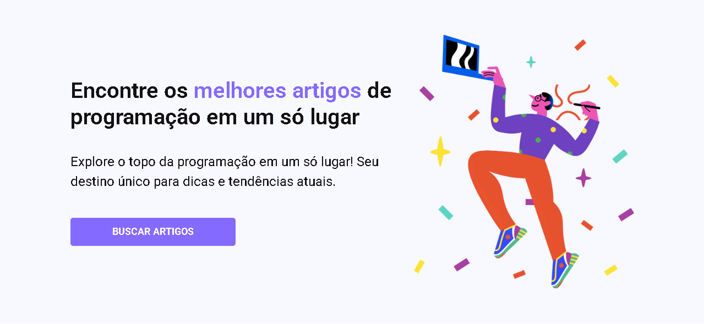

# 💻 CodeLab - Tech Blog



## 🚀 Sobre o projeto

O **CodeLab - Tech Blog** é uma landing page moderna voltada para a divulgação de conteúdos sobre tecnologia e programação.

A aplicação apresenta artigos recomendados, uma seção de destaque para atrair leitores e um formulário de contato, utilizando um design limpo, responsivo e focado na experiência do usuário.

Este projeto foi desenvolvido **exclusivamente para fins educacionais**, com base em um layout disponibilizado pelo curso do desenvolvedor front-end **Yuri Silva**.

---

## 🎯 Objetivo

Praticar e consolidar conhecimentos em:

* Estruturação semântica com HTML5
* Estilização moderna com CSS3
* Responsividade para diferentes dispositivos
* Utilização do Bootstrap para apoio ao layout
* Organização visual de componentes
* Construção de interfaces inspiradas em layouts profissionais

---

## 🛠️ Tecnologias utilizadas

* 🧱 HTML5
* 🎨 CSS3
* 🎯 Bootstrap 5
* 🔤 Google Fonts (Roboto)
* 📱 Design Responsivo

---

## ✨ Funcionalidades

* 📰 Exibição de artigos recomendados
* 📱 Layout totalmente responsivo
* 🎨 Interface moderna baseada em design do Figma
* 📩 Formulário de contato estilizado
* 🔗 Botão de destaque para navegação
* 📚 Cards organizados para apresentação de conteúdo

---

## 📂 Estrutura do projeto

```text
Code_Lab-tech-blog/
│
├── src/
│   ├── css/
│   ├── images/
│
├── index.html
├── preview.png
└── README.md
```

---

## 🌐 Acesse o projeto

🔗 **Deploy (GitHub Pages):**
👉 https://anaclarissi.github.io/Code_Lab-tech-blog/

🔗 **Repositório:**
👉 https://github.com/anaClarissi/Code_Lab-tech-blog

---

## 👩‍💻 Sobre mim

Olá! Eu sou a **Ana Clarissi** 👋

* 💻 GitHub:
  👉 https://github.com/anaClarissi

* 💼 LinkedIn:
  👉 https://www.linkedin.com/in/anaclarissi/

* 🎯 Frontend Mentor:
  👉 https://www.frontendmentor.io/profile/anaClarissi

---

## 📚 Créditos

Este projeto foi desenvolvido com base no layout disponibilizado por:

* 👨‍💻 Yuri Silva (Front-end Developer)
  👉 https://iuricode.com

---

## ⚠️ Aviso

Este é um **projeto estudantil**, desenvolvido exclusivamente para prática e aprendizado.

Não possui fins comerciais.

---

## 📌 Aprendizados

Durante o desenvolvimento deste projeto foi possível praticar:

* Estruturação de páginas responsivas
* Utilização de CSS Grid e Flexbox
* Organização de componentes reutilizáveis
* Boas práticas de HTML semântico
* Integração do Bootstrap em projetos front-end

---

## 🔮 Melhorias futuras

* Implementar busca funcional de artigos
* Integração com uma API de conteúdo
* Sistema de categorias e filtros
* Página individual para cada artigo
* Modo escuro (Dark Mode)
* Animações e microinterações mais avançadas
